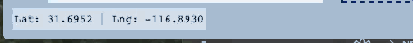

# React Leaflet Custom Components

This repo is a playground for development of custom components for React-Leaflet.  If you wish to use any of these, copy their source code.  I imagine that most of these components would need to be further customized to suit any given application's needs, so there is currently no npm package available.  If you find you want the ease of writing `import { SomeComponent } from 'react-leaflet-custom-components'`, open up an issue and I'll work on making a package.

## :eyes: [Demo (CodeSandBox)](https://codesandbox.io/s/github/slutske22/react-leaflet-custom-components) :eyes:

## Regular Map Components

All components listed here are designed to be used as direct children of the `<Map />` component.  They are written according to the [react-leaflet: Creating custom components](https://react-leaflet.js.org/docs/en/custom-components.html) guide.

### Editable Popup

  

    
  

  A popup component with additional features.  This component has its own [repo](https://github.com/slutske22/React-Leaflet-Editable-Popup) and [npm package](https://www.npmjs.com/package/react-leaflet-editable-popup).  Check out the documentation there for details on how to install and use.
    
### Arrowheads

  

    
  

  A react-leaflet wrapper for [leaflet-arrowheads](https://github.com/slutske22/leaflet-arrowheads).  This component has its own [repo](https://github.com/slutske22/react-leaflet-arrowheads) and [npm package](https://www.npmjs.com/package/react-leaflet-arrowheads). Check out the documentation there for details on how to install and use.

### ActiveArea

A react-leaflet wrapper for the [leaflet-active-area](https://github.com/Mappy/Leaflet-active-area) plugin.

### Esri-Leaflet GeoSearch

  

A react-leaflet wrapper for the [esri-leaflet-geocoder geosearch](https://esri.github.io/esri-leaflet/api-reference/controls/geosearch.html).

### MousePosition

  

A small component which gives the user's mouse position in latitude and longitude.  Extended from [Leaflet's Control Class](https://leafletjs.com/reference-1.6.0.html#control).   Duplicated almost exactly from Vadim Gremyachev's answer in https://stackoverflow.com/questions/52012591/react-leaflet-create-a-custom-components.

### RandomMarkerButton

A button to randomly place a marker anywhere within the map's bounds.  Not currently hooked up to any react state objects.
TODO:  Allow for state management callback similar to EditablePopup example.

## Custom Layers

### EsriLeafletLayer

This generic use layer can create any type of [esri-leaflet layer](https://esri.github.io/esri-leaflet/tutorials/introduction-to-layer-types.html).  All options that would be passed to any of these layers can be passed as props to this component.  The additional `layerType` props is required to specify which esri-leaflet layertype is desired (i.e. `featureLayer`, `imageMapLayer`, `tiledMapLayer`, etc.)

### EsriLeafletAuthLayer

The same as the `<EsriLeafletLayer />`, but wrapped in the `withEsriAuth` HOC.

### withEsriAuth

A higher order component which requests an Esri auth token (with your provided `client_id` and `client_secret` - please use your own), feeds it to the an `<EsriLeafletAuthLayer />`.

### TopoLayer

A set of customizable layers built from the [Mapbox Terrain RGB layer](https://docs.mapbox.com/help/troubleshooting/access-elevation-data/#mapbox-terrain-rgb).  Requires the `topotype` prop, which can takes values of `'dem'`, `'slope'`, `'aspect'`, or `'slopeaspect'`.  Will transform the RGB layer into colorized visualizations of these topography types.  Leverages web workers to do so.  The web worker code is found in the [\public\scripts folder](https://github.com/slutske22/react-leaflet-custom-components/tree/master/public/scripts) of the source code in this repo.  You can altar the .shading.js files to customize your colors.  You can learn more about these layers [here](https://observablehq.com/@slutske22/slope-and-aspect-in-leaflet).  Requires Mapbox access token - please use your own.

## Externalized Map Components

The following components are designed to be used *not* as direct children of the `<Map />` component.  This makes it possible for communication between the `<Map />` and components that are not direct descendants of the `<Map />` tree.
